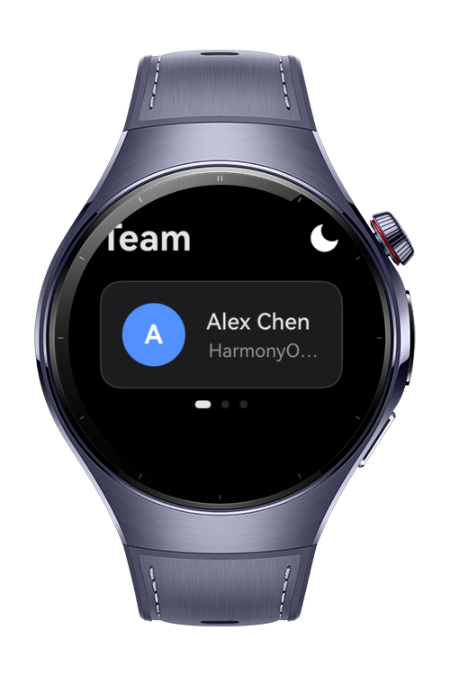

> **Note:** To access all shared projects, get information about environment setup, and view other guides, please visit [Explore-In-HMOS-Wearable Index](https://github.com/Explore-In-HMOS-Wearable/hmos-index).

# How to Implement Theme Aware Swipe Indicators

This codelab demonstrates theme aware indicators of a swiper component. It also includes a utility class that is responsible for changing and handling the themes inside the application.

# Preview

<div>
  
  
  
  
</div>

# Use Cases

- **Change Application Theme With One Click** - Changing theme using `UIAbilityContext`'s `setColorMode` function.
- **Apply Persistent Themes With Preferences** - Using `preferences` from `@Kit.ArkData` persistent themes can be achieved.
- **Color Management from Resources** - Manage the colors of your themes through resource files.
- **Reactive theme changing** - Observe the theme changes instantly.

# Tech Stack

- **Languages:** ArkTS
- **Frameworks:** HarmonyOS SDK, API version 6.0.1(21)+
- **Tools:** DevEco Studio 6.0.1 or later
- **Libraries & Kits:**
  - `@kit.AbilityKit` — `AbilityConstant`, `Configuration`, `ConfigurationConstant`, `UIAbility`, `Want`
  - `@kit.ArkUI` — `Swiper`

# Directory Structure

```
how-to-implement-theme-aware-swipe-indicators/
├── build-profile.json5
├── AppScope/
│   └── app.json5
└── entry/
    ├── build-profile.json5
    └── src/main/
        ├── module.json5
        ├── ets/
        │   ├── common/
        │   │   └── ThemeManager.ets       # All theme handling logic is here
        │   ├── components/
        │   │   └── ProfileCard.ets        # Profile Card component used to display profile cards
        │   ├── entryability/
        │   │   └── EntryAbility.ets       # UIAbility lifecycle + Persistent theme management
        │   ├── entrybackupability/
        │   │   └── EntryBackupAbility.ets # Default EntryBackupAbility file
        │   └── pages/
        │       └── Index.ets              # Main UI
        └── resources
        	├──/base/element/
            └──/dark/element/
```

# Constraints and Restrictions

## Supported Devices

- HarmonyOS wearable Watch 5

# License

**how-to-implement-theme-aware-swipe-indicators** is distributed under the terms of the MIT License.
See the [LICENSE](./LICENSE) for more information.
